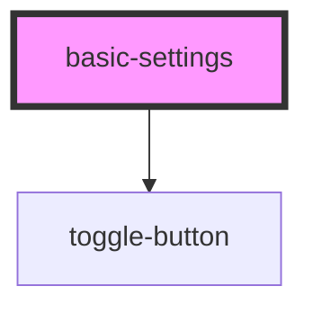

# basic-settings

<!-- Auto Generated Below -->

## Dependencies

### Depends on

- [toggle-button](../../common/toggle-button)

### Graph

----------------------------------------------

*Built with [StencilJS](https://stenciljs.com/)*
