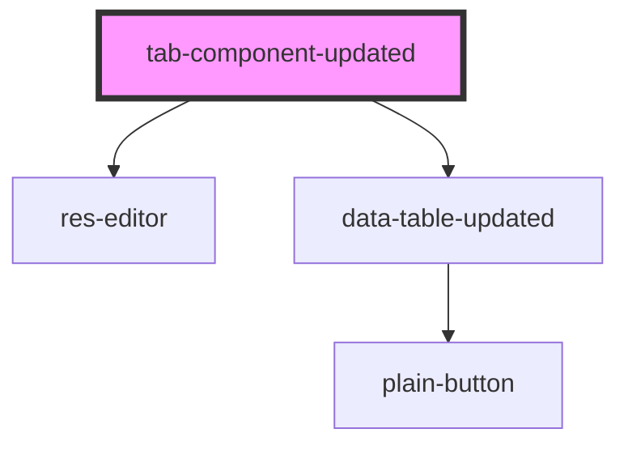

# tab-component-updated

<!-- Auto Generated Below -->

## Properties

| Property        | Attribute        | Description | Type  | Default     |
| --------------- | ---------------- | ----------- | ----- | ----------- |
| `doc`           | `doc`            |             | `any` | `undefined` |
| `responseLabel` | `response-label` |             | `any` | `undefined` |

## Dependencies

### Depends on

- [res-editor](../res-editor)
- [data-table-updated](../data-table-updated)

### Graph

----------------------------------------------

*Built with [StencilJS](https://stenciljs.com/)*
