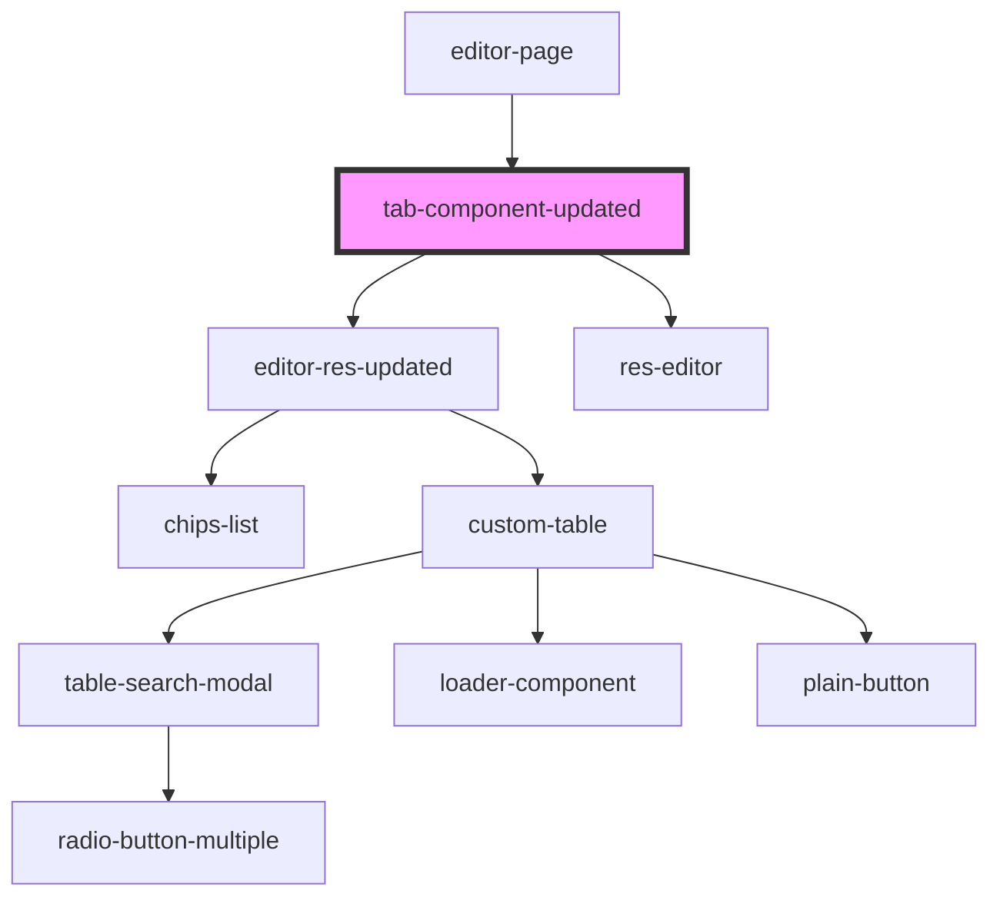

# tab-component-updated

<!-- Auto Generated Below -->

## Dependencies

### Used by

 - [editor-page](../editor-page)

### Depends on

- [editor-res-updated](../editor-res-updated)
- [res-editor](../res-editor)

### Graph

----------------------------------------------

*Built with [StencilJS](https://stenciljs.com/)*
