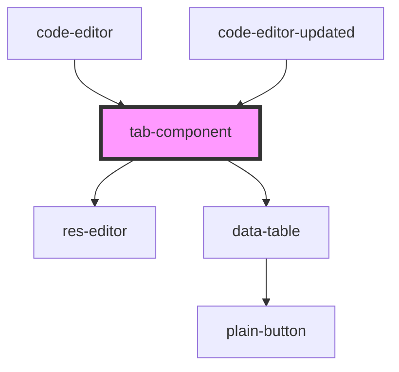

# tab-component

<!-- Auto Generated Below -->

## Properties

| Property        | Attribute        | Description | Type  | Default     |
| --------------- | ---------------- | ----------- | ----- | ----------- |
| `doc`           | `doc`            |             | `any` | `undefined` |
| `responseLabel` | `response-label` |             | `any` | `undefined` |

## Dependencies

### Used by

 - [code-editor](../code-editor)
 - [code-editor-updated](../code-editor-updated)

### Depends on

- [res-editor](../res-editor)
- [data-table](../data-table)

### Graph

----------------------------------------------

*Built with [StencilJS](https://stenciljs.com/)*
