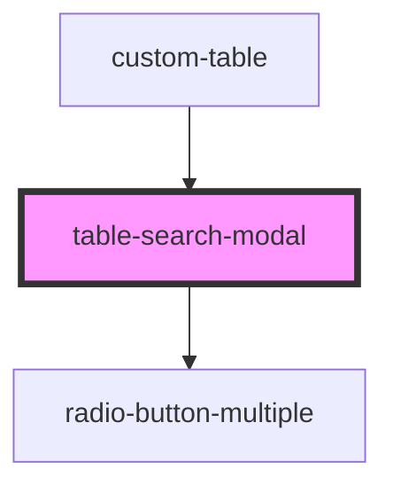

# table-search-modal

<!-- Auto Generated Below -->

## Properties

| Property       | Attribute       | Description | Type     | Default     |
| -------------- | --------------- | ----------- | -------- | ----------- |
| `alias`        | `alias`         |             | `string` | `undefined` |
| `clearSearch`  | `clear-search`  |             | `any`    | `undefined` |
| `icon`         | `icon`          |             | `any`    | `undefined` |
| `refresh`      | `refresh`       |             | `any`    | `undefined` |
| `searchMethod` | `search-method` |             | `any`    | `undefined` |
| `url`          | `url`           |             | `string` | `undefined` |

## Dependencies

### Used by

 - [custom-table](../custom-table)

### Depends on

- [radio-button-multiple](../radio-button-multiple)

### Graph

----------------------------------------------

*Built with [StencilJS](https://stenciljs.com/)*
