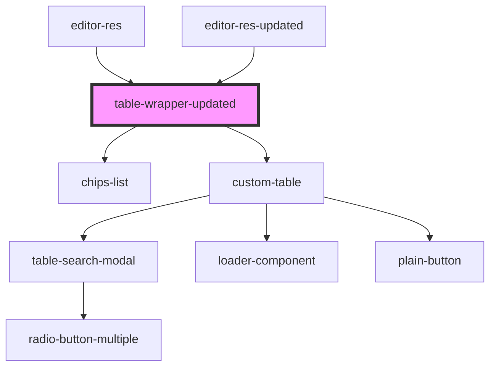

# table-wrapper-updated

<!-- Auto Generated Below -->

## Properties

| Property      | Attribute     | Description | Type       | Default     |
| ------------- | ------------- | ----------- | ---------- | ----------- |
| `api`         | `api`         |             | `any`      | `undefined` |
| `autocompute` | `autocompute` |             | `boolean`  | `undefined` |
| `data`        | --            |             | `object[]` | `undefined` |
| `headerList`  | --            |             | `object[]` | `undefined` |
| `rowPerPage`  | --            |             | `number[]` | `undefined` |

## Dependencies

### Used by

 - [editor-res](../editor-res)
 - [editor-res-updated](../editor-res-updated)

### Depends on

- [chips-list](../chips-list)
- [custom-table](../custom-table)

### Graph

----------------------------------------------

*Built with [StencilJS](https://stenciljs.com/)*
