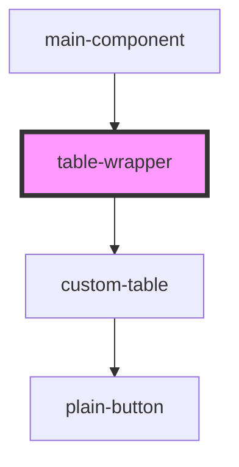

# table-wrapper

<!-- Auto Generated Below -->

## Properties

| Property     | Attribute | Description | Type       | Default     |
| ------------ | --------- | ----------- | ---------- | ----------- |
| `rowPerPage` | --        |             | `number[]` | `undefined` |
| `url`        | `url`     |             | `string`   | `undefined` |

## Dependencies

### Used by

 - [main-component](../main-component)

### Depends on

- [custom-table](../custom-table)

### Graph

----------------------------------------------

*Built with [StencilJS](https://stenciljs.com/)*
