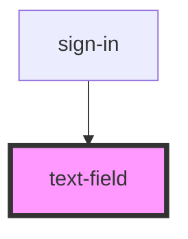

# text-field

<!-- Auto Generated Below -->

## Properties

| Property      | Attribute     | Description | Type                                          | Default       |
| ------------- | ------------- | ----------- | --------------------------------------------- | ------------- |
| `addClass`    | `add-class`   |             | `string`                                      | `undefined`   |
| `name`        | `name`        |             | `string`                                      | `undefined`   |
| `onChange`    | `on-change`   |             | `any`                                         | `undefined`   |
| `onClick`     | `on-click`    |             | `any`                                         | `undefined`   |
| `placeholder` | `placeholder` |             | `string`                                      | `'something'` |
| `type`        | `type`        |             | `"email" \| "password" \| "search" \| "text"` | `'text'`      |
| `width`       | `width`       |             | `"auto" \| "full"`                            | `'auto'`      |

## Dependencies

### Used by

 - [sign-in](../sign-in)

### Graph

----------------------------------------------

*Built with [StencilJS](https://stenciljs.com/)*
