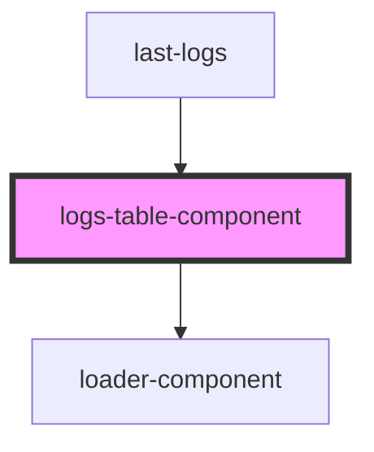

# logs-table-component

<!-- Auto Generated Below -->

## Properties

| Property         | Attribute          | Description | Type       | Default     |
| ---------------- | ------------------ | ----------- | ---------- | ----------- |
| `isLoading`      | `is-loading`       |             | `boolean`  | `undefined` |
| `isLoadingError` | `is-loading-error` |             | `boolean`  | `undefined` |
| `rows`           | --                 |             | `number[]` | `undefined` |
| `tableBody`      | --                 |             | `object[]` | `undefined` |
| `tableHeader`    | --                 |             | `object[]` | `undefined` |

## Dependencies

### Used by

 - [last-logs](../last-logs)

### Depends on

- [loader-component](../../common/loader-component)

### Graph

----------------------------------------------

*Built with [StencilJS](https://stenciljs.com/)*
