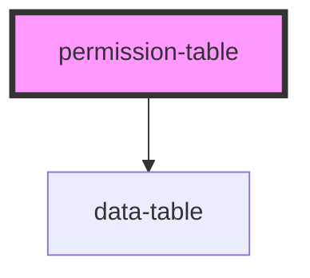

# permission-table

<!-- Auto Generated Below -->

## Properties

| Property           | Attribute          | Description | Type     | Default     |
| ------------------ | ------------------ | ----------- | -------- | ----------- |
| `permissionstring` | `permissionstring` |             | `string` | `undefined` |

## Dependencies

### Depends on

- [data-table](../../common/items/data-table)

### Graph

----------------------------------------------

*Built with [StencilJS](https://stenciljs.com/)*
