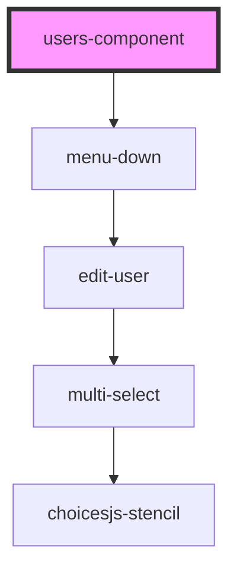

# users-component

<!-- Auto Generated Below -->

## Properties

| Property | Attribute | Description | Type  | Default     |
| -------- | --------- | ----------- | ----- | ----------- |
| `url`    | `url`     |             | `any` | `undefined` |

## Dependencies

### Depends on

- [menu-down](../menu-down)

### Graph

----------------------------------------------

*Built with [StencilJS](https://stenciljs.com/)*
