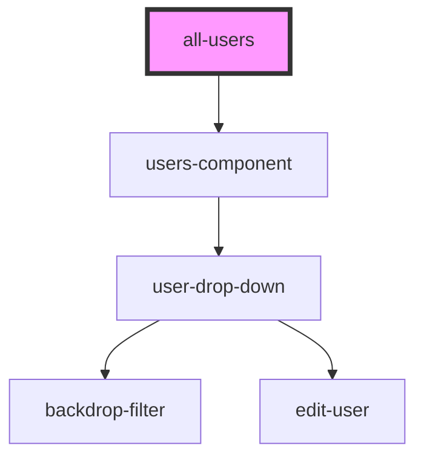

# all-users

<!-- Auto Generated Below -->

## Properties

| Property      | Attribute     | Description | Type     | Default     |
| ------------- | ------------- | ----------- | -------- | ----------- |
| `permissions` | `permissions` |             | `string` | `undefined` |
| `url`         | `url`         |             | `string` | `undefined` |
| `users`       | `users`       |             | `string` | `undefined` |

## Dependencies

### Depends on

- [users-component](../users-component)

### Graph

----------------------------------------------

*Built with [StencilJS](https://stenciljs.com/)*
