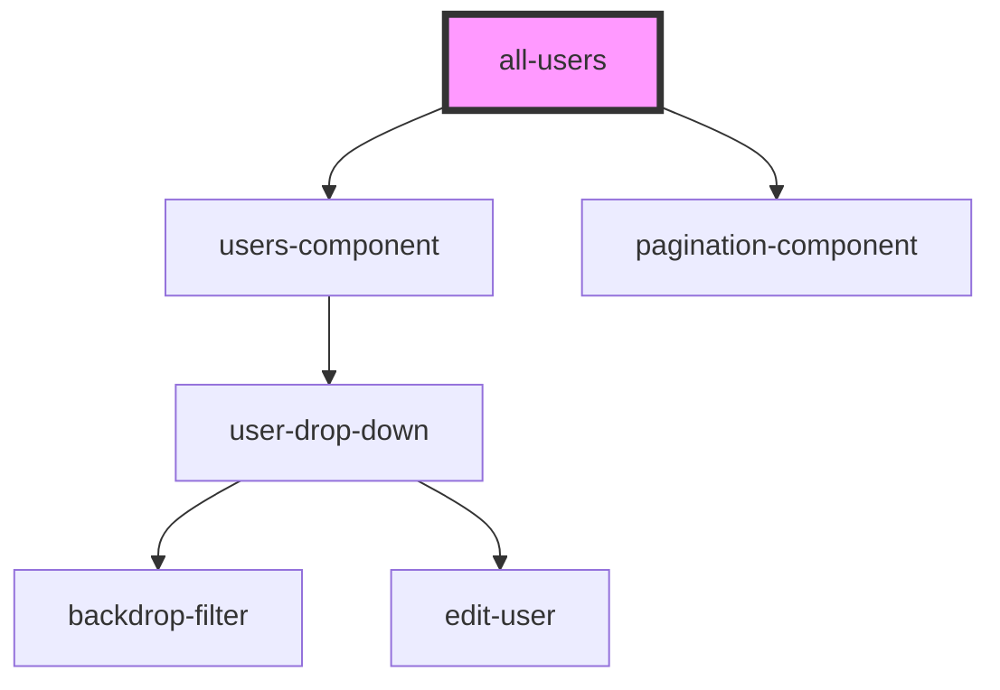

# all-users

<!-- Auto Generated Below -->

## Properties

| Property        | Attribute       | Description | Type     | Default     |
| --------------- | --------------- | ----------- | -------- | ----------- |
| `count`         | `count`         |             | `number` | `undefined` |
| `limitbackend`  | `limitbackend`  |             | `number` | `1`         |
| `offsetbackend` | `offsetbackend` |             | `number` | `0`         |
| `permissions`   | `permissions`   |             | `string` | `undefined` |
| `url`           | `url`           |             | `string` | `undefined` |
| `users`         | `users`         |             | `string` | `undefined` |

## Dependencies

### Depends on

- [users-component](../users-component)
- [pagination-component](../../common/pagination-component)

### Graph

----------------------------------------------

*Built with [StencilJS](https://stenciljs.com/)*
