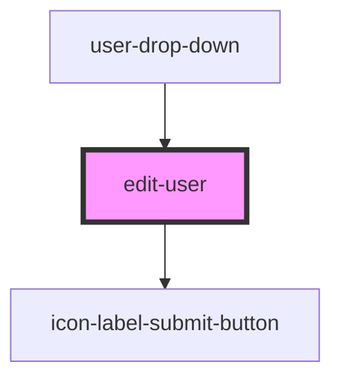

# edit-user

<!-- Auto Generated Below -->

## Properties

| Property         | Attribute         | Description | Type         | Default     |
| ---------------- | ----------------- | ----------- | ------------ | ----------- |
| `allPermissions` | `all-permissions` |             | `any`        | `undefined` |
| `ismodelopen`    | `ismodelopen`     |             | `boolean`    | `undefined` |
| `toggle`         | --                |             | `() => void` | `undefined` |
| `url`            | `url`             |             | `string`     | `undefined` |
| `userid`         | `userid`          |             | `number`     | `undefined` |
| `value`          | `value`           |             | `string`     | `undefined` |

## Dependencies

### Used by

 - [user-drop-down](../user-drop-down)

### Depends on

- [icon-label-submit-button](../../common/buttons/icon-label-submit-button)

### Graph

----------------------------------------------

*Built with [StencilJS](https://stenciljs.com/)*
