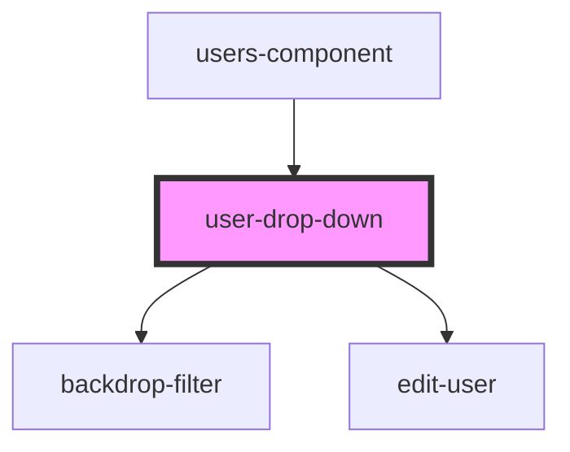

# user-drop-down

<!-- Auto Generated Below -->

## Properties

| Property            | Attribute   | Description | Type       | Default     |
| ------------------- | ----------- | ----------- | ---------- | ----------- |
| `email`             | `email`     |             | `string`   | `undefined` |
| `option`            | --          |             | `string[]` | `['Edit']`  |
| `parsedPermissions` | --          |             | `[]`       | `undefined` |
| `submiturl`         | `submiturl` |             | `string`   | `undefined` |
| `url`               | `url`       |             | `string`   | `undefined` |
| `userId`            | `user-id`   |             | `number`   | `0`         |

## Dependencies

### Used by

 - [users-component](../users-component)

### Depends on

- [backdrop-filter](../../common/backdrop-filter)
- [edit-user](../edit-user)

### Graph

----------------------------------------------

*Built with [StencilJS](https://stenciljs.com/)*
