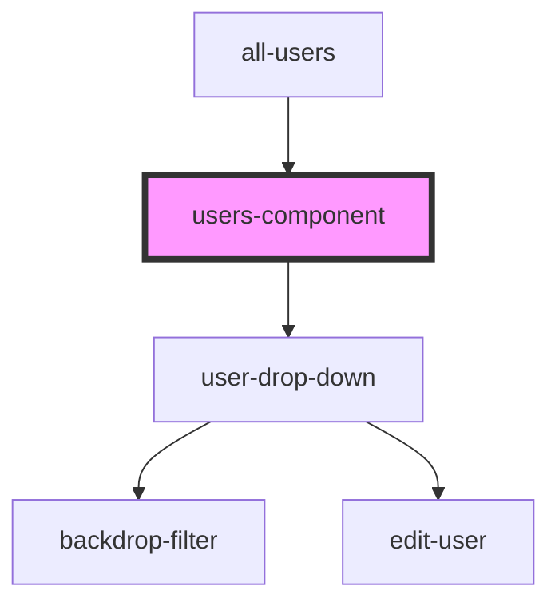

# users-component

<!-- Auto Generated Below -->

## Properties

| Property            | Attribute       | Description | Type         | Default     |
| ------------------- | --------------- | ----------- | ------------ | ----------- |
| `allPermissions`    | --              |             | `{}[]`       | `undefined` |
| `parsedPermissions` | --              |             | `[]`         | `undefined` |
| `refresh`           | --              |             | `() => void` | `undefined` |
| `updatedUsers`      | `updated-users` |             | `any`        | `undefined` |
| `url`               | `url`           |             | `string`     | `undefined` |

## Dependencies

### Used by

 - [all-users](../all-users)

### Depends on

- [user-drop-down](../user-drop-down)

### Graph

----------------------------------------------

*Built with [StencilJS](https://stenciljs.com/)*
